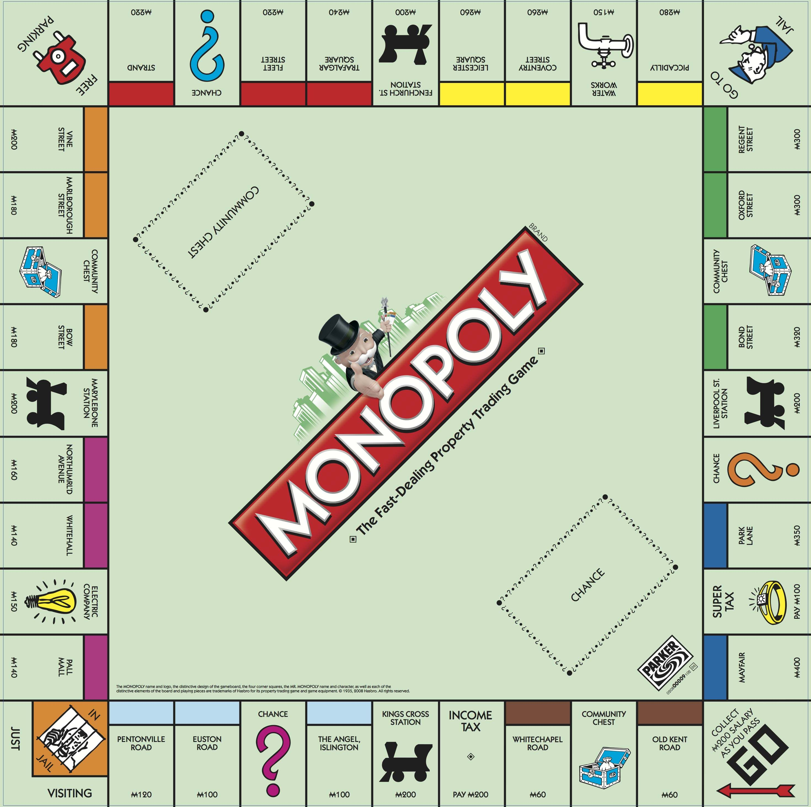
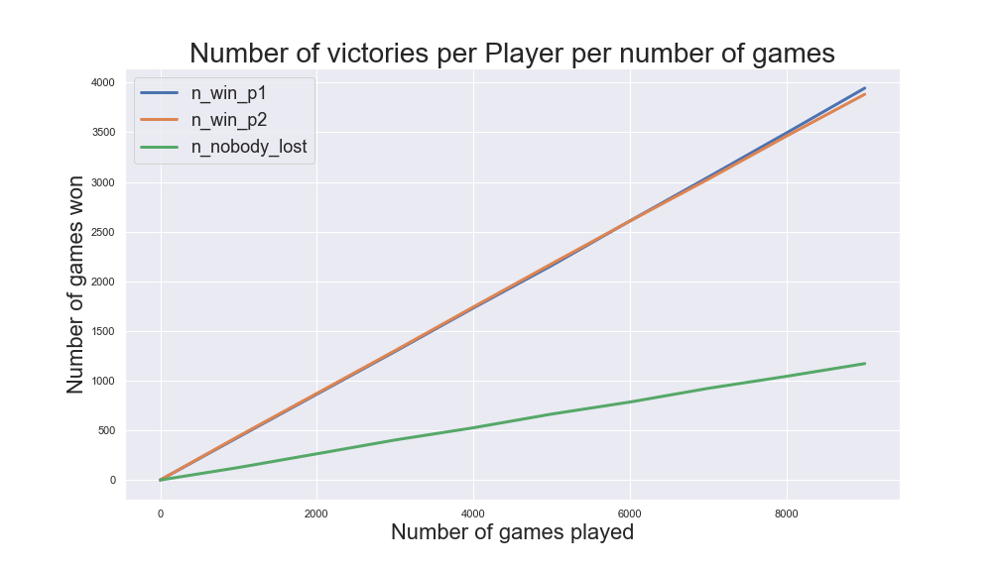
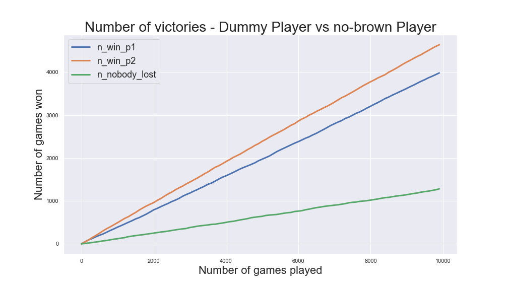
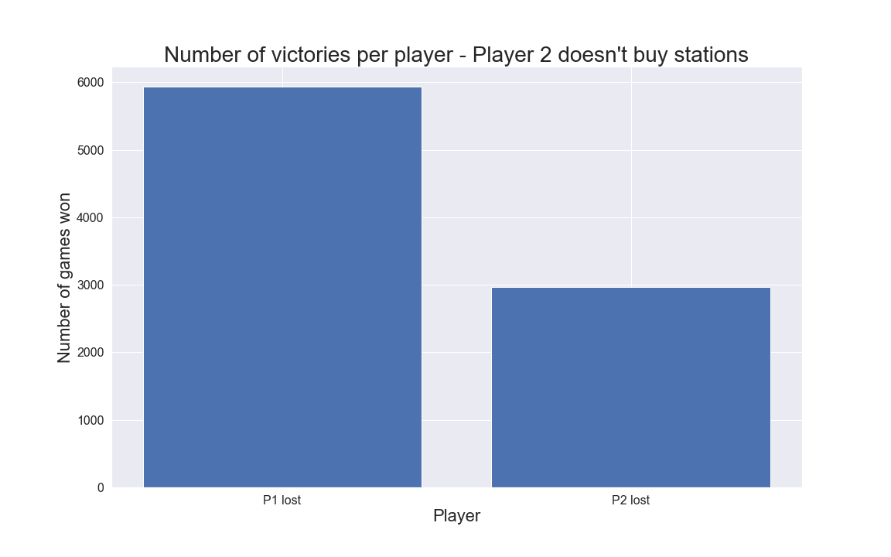
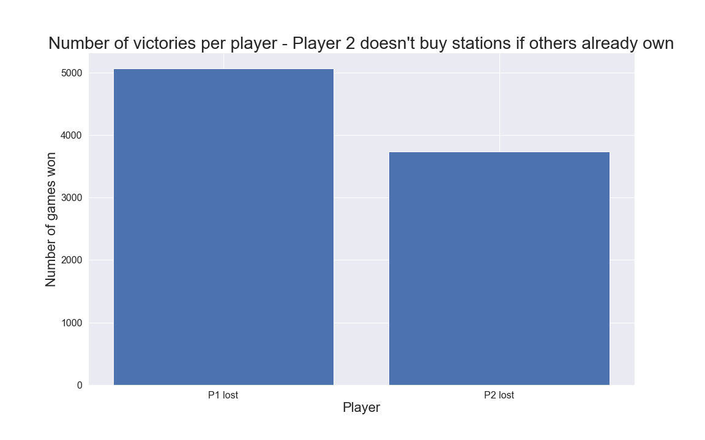
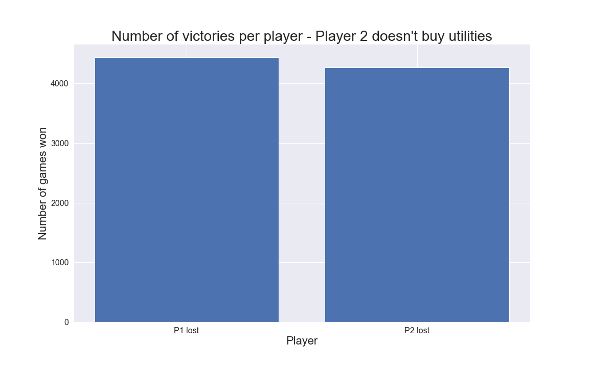
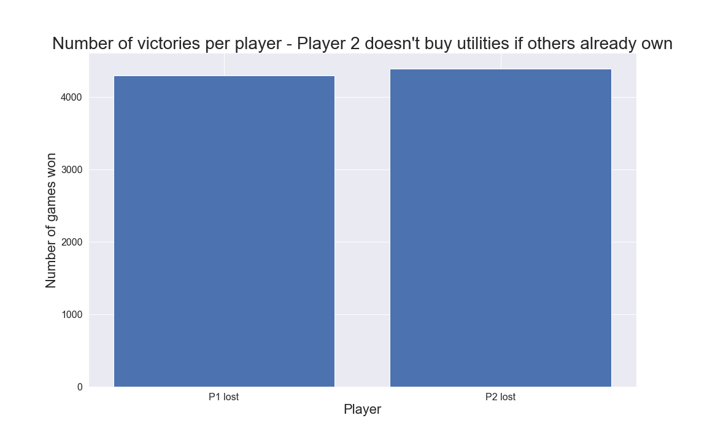
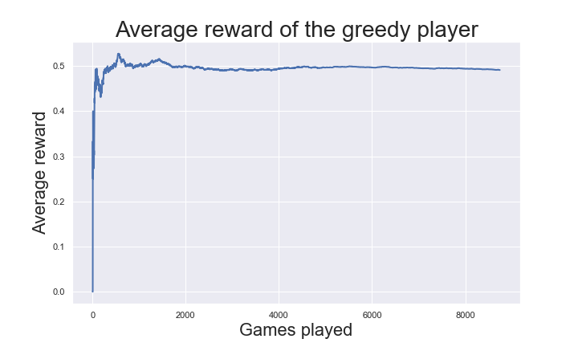

# MonopolySimulator

> Monopoly simulator based on Python.

<p align="center">

</p>

Monopoly simulator allows you to rapidly simulate the game of monopoly with N players. While the library provides an implementation of a simple naive player ("dummy"), their behaviour can be modified to test hypotheses about the best strategies and train intelligent agents with Machine Learning.

## Install

Use the package manager [pip](https://pip.pypa.io/en/stable/) to install monopoly_simulator.

```bash
pip install -i https://test.pypi.org/project/MonopolySimulator/0.0.1/
```
### version 0.0.2
* In this version "chance" cards are not implemented yet.
* Bids are not implemented.
* Trading is not implemented.
* **NOTE:** The game can reach stalemate. This is possible when trading cannot be done. This will be implemented in the future version, but for now a maximum number of turn should be set when running a simulation.

## Usage
A game is started setting the table's components: board, community chest cards and bank. Each player in the game receives these components and meets the other opponents (e.g., player1.meet_other_players([player2])). Each game's turn is run executing the command player.play(). The game ends when N-1 players have lost.

```python
from monosim.player import Player
from monosim.board import get_board, get_roads, get_properties, get_community_chest_cards, get_bank


if __name__ == '__main__':
    import random
    for seed in range(0, 10000):
        random.seed(seed)
        bank = get_bank()
        list_board, dict_roads = get_board(),  get_roads()
        dict_properties = get_properties()
        dict_community_chest_cards = get_community_chest_cards()
        community_cards_deck = list(dict_community_chest_cards.keys())
        player1 = Player('player1', 1, bank, list_board, dict_roads, dict_properties, community_cards_deck)
        player2 = Player('player2', 2, bank, list_board, dict_roads, dict_properties, community_cards_deck)

        player1.meet_other_players([player2])
        player2.meet_other_players([player1])

        list_players = [player1, player2]

        idx_count = 0
        while not player1.has_lost() and not player2.has_lost() and idx_count < 2000:
            for player in list_players:
                player.play()
            idx_count += 1
```

## Personalize players
Players' behaviour can be changed modifying the class Player. Here's an example of a player that never buys brown roads. This is done decorating the function buy().

In the example below, a player is modified so that it never buys brown roads.
```python
def modify_buy(buy):
    def _wrapper(self, dict_road_info, road_name):
        if dict_road_info['color'] == 'brown':
            pass
        else:
            buy(self, dict_road_info, road_name)
    return _wrapper

class Player_no_brown(Player):
    buy = modify_buy(Player.buy)
```

## Examples

### Dummy vs personalized player
Here we show two scenarios where two players play against each other following the same strategy, or when one player's strategy is modified.
In the left figure below we show the number of victories for each player every N games, where both players have a default behaviour (a.k.a. Dummy). The blue line shows the number of times player 1 won, while the orange line represents the number of times player 2 won. The green line represents the number of games that end in stalemate. In the right figure, the strategy of player 1 is modified, such as it never buys brown properties. 
Cleary, the modified player's strategy doesn't pay off. More details in the notebook: [dummy_vs_no_brown_players.](notebooks/dummy_vs_no_brown_players.ipynb)

<p float="left">
  
  
</p>

### Stations and utilities
A very common strategy to win at Monopoly suggests avoiding buying utilities. Someone also suggests that stations are not a good purchase on average. Here we test these theories simulating various games where one player never buys stations. Based on the assumptions that stations are less important when a player doesn't own all of them, we also personalize a player to avoid buying stations if at least another player already owns one.
The left plot below shows that avoiding buying stations unconditionally is not a good strategy, which leads to losing the game much more often than normal. The right plot shows that buying stations only when nobody else bought one is a better strategy, but still not a winning one.
<p float="left">
  
  
</p>

The same simulation is repeated for utilities, which leads to different results. The left plot below shows the number of lost games by a player that doesn't buy utilities at all. It can be noticed that the number of games lost is not considerably lower compared to a normal player. Quite interestingly, avoiding buying utilities when at least another player has already bought one seems to lead to the opposite result. As shown in the right plot below, such a player wins slightly more often than a regular player.
Here's the notebook used to run these simulations: [Stations and utilities.](notebooks/do_not_buy_utilities.ipynb)
<p float="left">
  
  
</p>

### K-arm trained player
Here a player learns whether it's good to buy a brown property or not. The problem is posed as a simple K-arm bandit problem, where the reward is 1 if the player wins, and 0 otherwise. 
The agent's action-value is estimated using the sample-average method. The figure below (left) shows the expected reward, incrementally updated using a greedy algorithm. The right figure below
shows the average reward training the agent with an epsilon-greedy algorithm. In this version of the algorithm, the action ("buy" vs "do-not-buy") is chosen randomly with probability epsilon. This
algorithm, unlike the previous, allows the agent exploring different strategies to understand if it's convenient to buy a brown property or not. The figure shows the results for different choices of the
epsilon.

Further details in the notebook: [No-brown player using a K-Arm greedy agent.](notebooks/k-arms.ipynb)

<p float="left">
  
  
</p>
